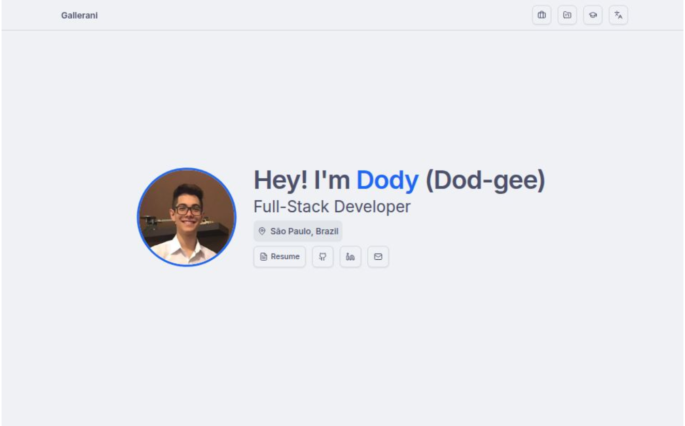

# 💻 GardenMovie Portfolio

A modern, responsive portfolio website built with React, Vite, TypeScript, Tailwind CSS, and shadcn/ui.



## 🛠️ Design & Technology Choices

- **Vite**: Chosen for its fast development experience and simple configuration, ideal for a frontend-only application.
- **React + TypeScript**: For type safety and a robust component-based architecture.
- **Tailwind CSS**: Enables rapid, utility-first styling and easy theming.
- **shadcn/ui**: Used for accessible, customizable UI components that blend well with Tailwind and speed up development.
- **Lucide Icons**: For a modern, consistent icon set.

## 📦 Run Locally

1. **Clone the repo:**
   ```bash
   git clone https://github.com/GardenMovie/portfolio.git
   cd portfolio
   ```
2. **Install dependencies:**
   ```bash
   pnpm install
   # or
   npm install
   # or
   yarn install
   ```
3. **Run the development server:**
   ```bash
   pnpm dev
   # or
   npm run dev
   # or
   yarn dev
   ```
4. **Open in your browser:**
   Visit [http://localhost:5173](http://localhost:5173)

## 🌐 Deployment

This website has been deployed on Vercel with CI/CD integrations from the beginning.

---

> Made with ❤️ by [GardenMovie](https://github.com/GardenMovie)
